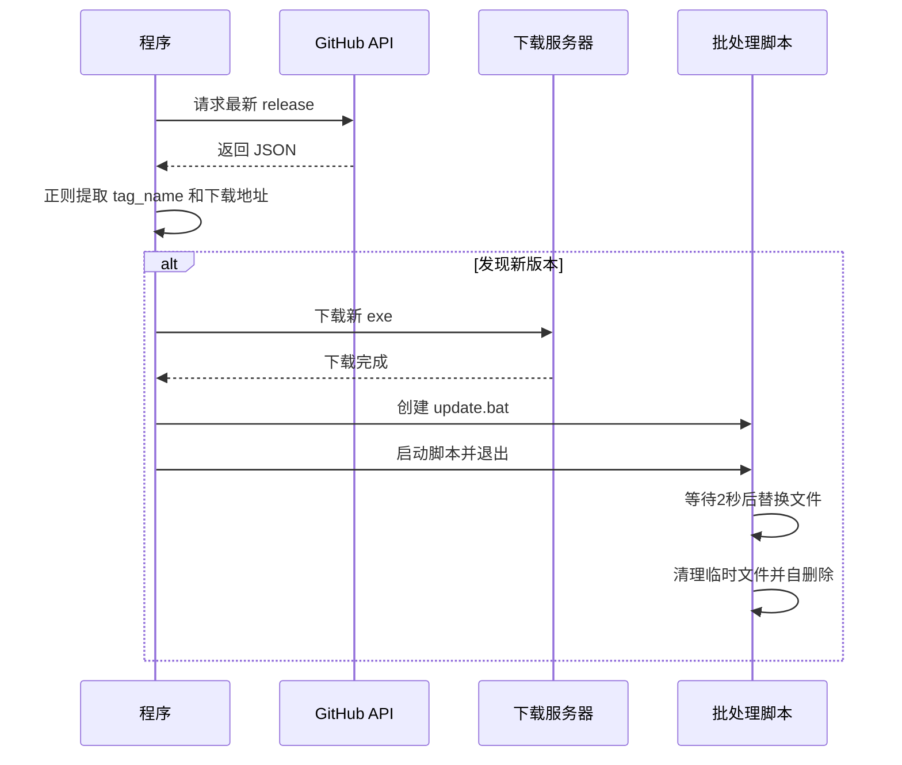

# 陈叔叔系统优化工具 (SeewoOptimizer)

**PEACE & LOVE | 川中计算机协会 荣誉出品**

---

## 📖 简介

陈叔叔系统优化工具是一款专为**老希沃/多媒体教室环境**设计的轻量级系统优化工具。它解决了多媒体设备常见的三大痛点：

- **系统时间不准确**（因主板电池失效或 Windows Time 服务异常）
- **音量过小老师不会调导致同学们不能愉快地观看课件内视频**（不知道要退出ppt调系统时间）
- **WPS 2019无法打开课件**（需要结束wps.exe进程再打开课件）

本工具完全**绿色、静默、自动**，无需用户干预即可完成时间同步、音量调节和进程清理，并支持开机自启和自动更新。

---

## ✨ 功能特性

| 功能 | 说明 |
|------|------|
| 🕐 **NTP 时间同步** | 内置 10 个国内外 NTP 服务器（阿里云、苹果、谷歌、NIST 等），自动重试、支持多阶段切换 |
| 🔊 **系统音量调节** | 可自定义开机音量百分比，调用 Windows Core Audio API 直接调节主音量 |
| 🧹 **结束 WPS 进程** | 一键清理 wps.exe |
| 🔄 **开机自启** | 通过 Windows 任务计划实现用户登录后自动启动（无需管理员权限） |
| 🤫 **静默启动** | 启动后自动隐藏到系统托盘，不干扰日常使用 |
| 📦 **自动更新** | 后台检测 GitHub Releases，静默下载并替换，无弹窗无打扰 |
| 📝 **详细日志** | 所有操作记录在 `%LOCALAPPDATA%\TimeSyncTool\startup.log` |
| 🧹 **一键卸载** | 输入暗号 `0319` 后清理所有日志、注册表、任务计划（需手动删除 exe） |
| 🌐 **开源仓库** | 内置跳转按钮，一键访问 GitHub 源码 |

---

## 🖼️ 界面预览


- 主窗口实时显示同步日志
- 右下角按钮支持：重新同步、显示窗口、隐藏到托盘、GitHub仓库、卸载程序

---

## 🚀 使用方法

### 1. 首次运行

从[Release发布页](https://github.com/Foxelf-Studio/SeewoOptimizer/releases)下载最新版，放到任意一个文件夹，双击 `SeewoOpt.exe`，程序将自动：

- 添加计划任务开机自启
- 调节系统音量（默认 60%）
- 结束 WPS 进程
- 从多个 NTP 服务器同步时间（自动选择可用服务器）
- 同步成功后自动隐藏到系统托盘
- 后台检测新版本

### 2. 设置选项

点击菜单栏 **文件 → 设置** 打开设置窗口：

| 选项 | 说明 |
|------|------|
| 开机自启 | 登录后自动启动（通过任务计划实现） |
| 静默启动 | 启动时不显示主窗口，直接最小化到托盘 |
| 自动调节音量 | 勾选后每次启动将音量设为指定值（0-100） |
| 结束 WPS 进程 | 勾选后启动时自动清理 WPS 进程 |

设置自动保存到注册表 `HKCU\Software\TimeSyncTool`。

### 3. 手动同步

点击 **重新同步** 按钮可再次执行时间同步流程。

### 4. 查看日志

菜单栏 **视图 → 打开日志** 将自动打开日志文件夹并选中日志文件。

### 5. 卸载程序

点击 **卸载程序** 按钮 → 输入暗号 `0319` → 确认后自动删除：

- 日志目录
- 更新缓存目录
- 注册表项 `HKCU\Software\TimeSyncTool`
- 开机自启任务计划

**注意**：程序 exe 文件需手动删除（运行中无法自删）。

---

## 🛠️ 实现原理

### 1. 时间同步（NTP）


- 使用 UDP 协议连接 NTP 服务器（端口 123）
- 解析 NTP 协议包中的 `transmit timestamp` 字段
- 转换为本地时间（东八区）并通过 `SetLocalTime` API 设置
- 支持多阶段重试（第一阶段最多 3 次，第二阶段最多 3 次）

### 2. 音量调节

- 通过 Core Audio API 获取默认音频渲染设备
- 调用 `IAudioEndpointVolume::SetMasterVolumeLevelScalar` 设置主音量（0.0 - 1.0）

### 3. 开机自启

- 使用 `Microsoft.Win32.TaskScheduler` 库创建任务计划
- 触发器：用户登录时，延迟 5 秒启动
- 优点：无需管理员权限，不受杀毒软件拦截

### 4. 自动更新



- 使用 `WebClient` 下载，支持进度回调
- 30 秒超时控制，失败自动重试 3 次
- 批处理脚本静默替换，不弹出命令行窗口
- 更新完成后程序自动退出，下次启动即为新版本

### 5. 单实例控制

- 使用全局互斥体 `TimeSyncTool_UniqueMutex` 防止多开
- 程序退出时自动释放（无需手动释放，避免跨线程异常）

### 6. 卸载清理

- 删除 `%LOCALAPPDATA%\TimeSyncTool` 下所有子目录
- 删除注册表 `HKCU\Software\TimeSyncTool`
- 删除任务计划 `TimeSyncTool`
- 需要输入暗号 `0319` 确认，防止误操作

---

## 📁 项目结构

```
SeewoOptimizer/
├── Program.cs              # 程序入口、单实例、更新逻辑、DLL 提取
├── TimeSyncForm.cs         # 主窗体、时间同步核心、音量调节、WPS 清理
├── SettingsForm.cs         # 设置窗体（需自行实现）
├── Microsoft.Win32.TaskScheduler.dll  # 任务计划依赖（内嵌资源）
└── app.ico                 # 程序图标（嵌入资源）
```

---

## 🔧 编译与运行

### 环境要求

- Windows 7 SP1 或更高版本
- .NET Framework 4.7.2 或更高版本

### 编译步骤

1. 克隆仓库
```bash
git clone https://github.com/Foxelf-Studio/SeewoOptimizer.git
```

2. 使用 Visual Studio 2022 打开解决方案

3. 还原 NuGet 包（如果有）

4. 编译生成（Release / AnyCPU）

5. 运行 `bin\Release\SeewoOpt.exe`

---

## 📄 许可证

MIT License © 2025 川中计算机协会

本工具仅供学习交流，请勿用于商业用途。

---

## 🤝 贡献与反馈

- 提交 Issue：[GitHub Issues](https://github.com/Foxelf-Studio/SeewoOptimizer/issues)
